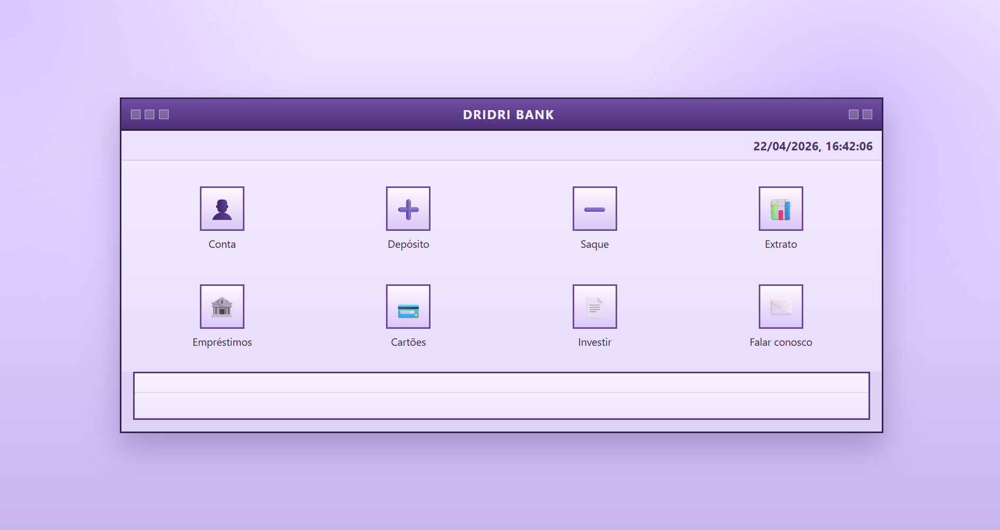

# Dridri Bank

Sistema bancario com frontend em TypeScript (Vite) e backend em Java (API HTTP). 

##





## Requisitos

- Node.js 18+
- Java 22
- Maven (opcional, se nao estiver no PATH use o run.bat)

## Como rodar

### Frontend

```powershell
cd front
npm install
npm run dev
```

Frontend: http://localhost:5173

### Backend

```powershell
cd back
.\run.bat
```

Backend: http://localhost:8080


